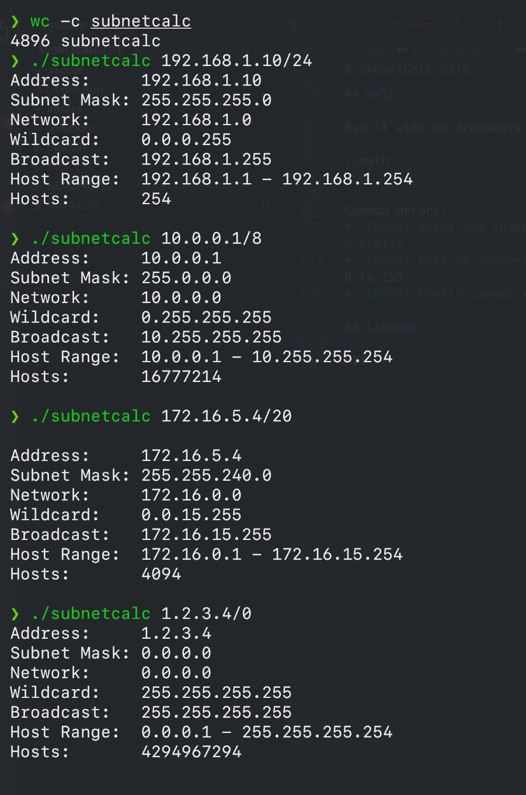

# SubnetCalc Lite

A tiny IPv4 subnet calculator for Linux written in C as my first ever C project. The compiled binary is **4,986 bytes** uncompressed, measured with `wc -c` and dynamically linked against glibc.

Made for Hack Club Crescent's [Lightweight](https://crescent.hackclub.com/guides/lightweight) card

## Description

SubnetCalc Lite takes an IPv4 address in CIDR notation (like `192.168.1.10/24`), checks that it's valid, and outputs this information:

```
./subnetcalc 192.168.1.10/24
Address:     192.168.1.10
Subnet Mask: 255.255.255.0
Network:     192.168.1.0
Wildcard:    0.0.0.255
Broadcast:   192.168.1.255
Host Range:  192.168.1.1 - 192.168.1.254
Hosts:       254
```

### How i got it under 5 KB

My first build using `gcc main.c` was 16,382 bytes but most of that isn't my code. The actual program code is under 1 KB, and the rest is ELF overhead, startup code and padding so I used these flags to cut it down:

| Flag | What it does |
|---|---|
| `-Os` | Optimise for size instead of speed |
| `-s` | Strip the symbol table |
| `-fno-asynchronous-unwind-tables` | Skip the stack unwinding info that C doesn't need |
| `-fcf-protection=none` | Skip CET hardening (saves `endbr64` instructions and an extra PLT section) |
| `-fno-stack-protector` | Skip stack canary checks |
| `-no-pie` | Build a fixed-address executable, which needs fewer relocations |
| `-Wl,--gc-sections` | Throw away unused sections |
| `-Wl,-z,noseparate-code` | Don't put code in its own page-aligned segment, which removes a lot of padding |
| `-Wl,-z,norelro` | Skip the read-only relocation segment |
| `-Wl,-z,nodynamic-undefined-weak` | Don't import optional symbols the program never uses, like `__gmon_start__` |
| `-Wl,--build-id=none` | Skip the build ID note |
| `-Wl,--no-eh-frame-hdr` | Skip the exception frame lookup table |
| `strip -R ...` | Remove `.comment`, `.note.gnu.property`, `.note.ABI-tag` and `.eh_frame`, none of which the program needs to run |

> Note: Claude helped with these

### Screenshots



## Getting Started

### Dependencies

* Linux on x86-64
* `gcc` and `binutils` (Tested with gcc 13.3 and GNU ld 2.42 on Ubuntu 24.04)
* glibc

### Installing

Clone the repo:
```
git clone https://github.com/tomTTFB/SubnetCalc-Lite.git
cd SubnetCalc-Lite
```

Build it:
```
chmod +x build.sh
./build.sh
```

Check the size:
```
wc -c subnetcalc
```

Other gcc versions or distros may give a slightly different size because each one sets its own defaults.

### Executing program

* Pass an IPv4 address with a prefix length:
```
./subnetcalc 192.168.1.10/24
```
```
Address:     192.168.1.10
Subnet Mask: 255.255.255.0
Network:     192.168.1.0
Wildcard:    0.0.0.255
Broadcast:   192.168.1.255
Host Range:  192.168.1.1 - 192.168.1.254
Hosts:       254
```

## Help

Run it with no arguments to see the usage:
```
./subnetcalc
```

Common errors:
* `ERROR: Input not shaped like address`: the input should look like `a.b.c.d/prefix`
* `ERROR: Part of address exceeds 255`: each of the four numbers has to be 0 to 255
* `ERROR: Prefix cannot exceed 32`: the prefix has to be 0 to 32

## License

MIT